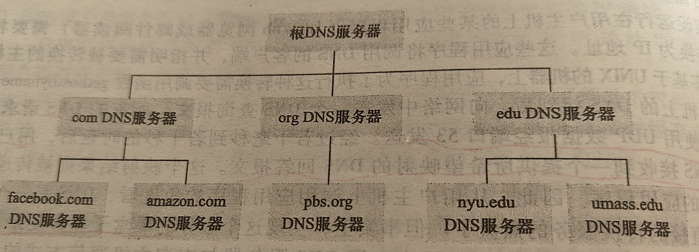
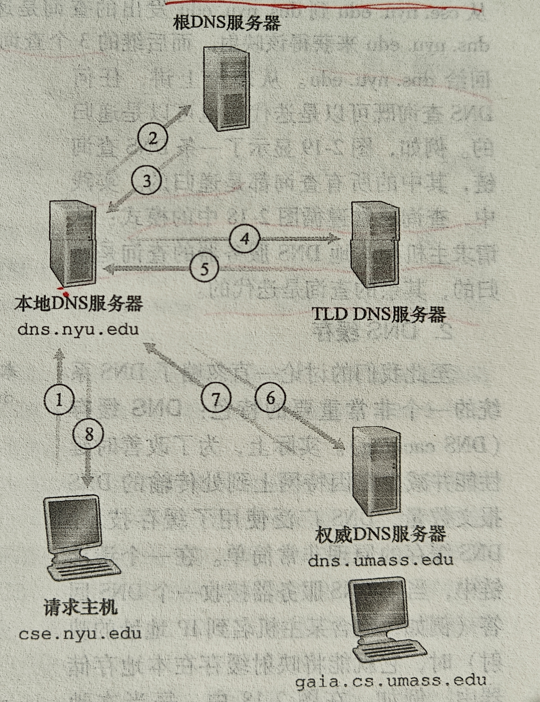

# 2.4 DNS: 因特网的目录服务

两种标识主机的方式: 主机名(fanyi.baidu.com)和 IP 地址

注: 比如在 fanyi.baidu.com 中，fanyi 是主机名，baidu.com 是域名，baidu 是二级域名，.com 是顶级域名, 这里为了方便表述, 我把 fanyi.baidu.com 统称为主机名

IP 地址: 4 个字节组成, 并有严格的层次结构

## 2.4.1 DNS 提供的服务

DNS: 域名系统, 主要任务是根据主机名找到对应的 IP 地址(不完全准确, 严格来说是域名)

1. 一个由分层的 DNS 服务器实现的分布式数据库
2. 一个应用层协议, 使主机能够查询分布式数据库
3. DNS 服务器一般运行在 UNIX 机器上, 一般运行 BIND 软件
4. DNS 协议运行在 UDP 上, 端口 53

其他服务:

1. 主机别名
2. 邮件服务器别名
3. 负载分配: 一个主机名可能对应多个 IP 地址, 每个 IP 地址对应不同的服务器(服务器提供的服务是相同的, 为了减压), 那 DNS 就可以进行负载分配, 在 DNS 中, 有一个集合, DNS 会在这个集合中轮询发出相应的 IP 地址

## 2.4.2 DNS 工作机概述

单一 DNS 服务器缺陷:

1. 单点故障
2. 通信容量
3. 远距离的集中式数据库
4. 维护

### 分布式、层次数据库

- DNS 服务器的层次结构

根 DNS 服务器--->顶级域 DNS 服务器--->权威 DNS 服务器



- DNS 服务器的交互方式

本地 DNS 服务器由 ISP 提供, 整个域名查询除了主机到本地 DNS 服务器之外, 其他均采用迭代的方式查询 IP 地址

根服务器、顶级服务器一般返回的是 IP 地址列表，内容下一层 DNS 服务器的



### DNS 缓存

一般会缓存在本地 DNS 服务器上，当其他主机再次访问时会直接调用而不是查询, 缓存有时间限制, 超过期限后会直接删除

## 2.4.3 DNS 记录和报文

DNS 服务器存储了资源记录(RR):

```
(Name, Value, Type, TTL)
```

TTL 是生存时间, 从缓存中删去的时间

- Type = A : Name 是主机名, Value 是 IP 地址
- Type = NS : Name 是域名或顶级域, Value 是权威 DNS 服务器的主机名, 这个主机名知道如何获得该域中主机的 IP 地址
- Type = CNAME : Name 是主机别名, Value 是规范主机名
- Type = MX : Name 是邮件服务器别名, Value 是规范主机名

举个例子:

我输入 fanyi.baidu.com, 本地 DNS 服务器向根服务器发送请求, 根服务器储存(.com, a.gtld-servers.net, NS, TTL)等 和 (a.gtld-servers.net, 192.5.6.30, A, TTL)等资源记录, 然后返回 顶级域 DNS 服务器 的"指引"（NS + A 记录）列表, 给 本地 DNS 服务器 查询, 然后本地 DNS 服务器向 192.5.6.30 发送请求（假如选择了这个顶级域）, 顶级域 DNS 服务器 存储(baidu.com, ns1.baidu.com, NS, TTL)等 和 (ns1.baidu.com, 10.1.1.10, A, TTL)等, 返回 权威 DNS 服务器 的"指引"（NS + A 记录）列表给 本地 DNS 服务器, 然后 本地 DNS 服务器 访问权威服务器, 权威服务器返回 fanyi.baidu.com 的具体地址。然后本地 DNS 服务器给主机返回具体的 IP 地址。

### DNS 报文

标识符 标志

问题数 回答 RR 数

权威 RR 数 附加 RR 数 -> 以上共 12 字节

问题(问题的变量) -> 查询的名字和类型字段

回答(资源记录的变量) -> 对查询的响应中的 RR

权威(资源记录的变量) -> 权威服务器的记录

附加信息(资源记录的变量) -> 可被使用的附加 "有帮助的" 信息

---

解释:

标识符: 匹配请求和回答
标志: 如 0 表示查询, 1 表示回答, 还包含递归查询, 请求是否为权威服务器等

问题: 主机名 + 类型(A 或 MX)
回答: 例子中的 NS+A 的资源记录列表
权威: 其他权威服务器的记录
